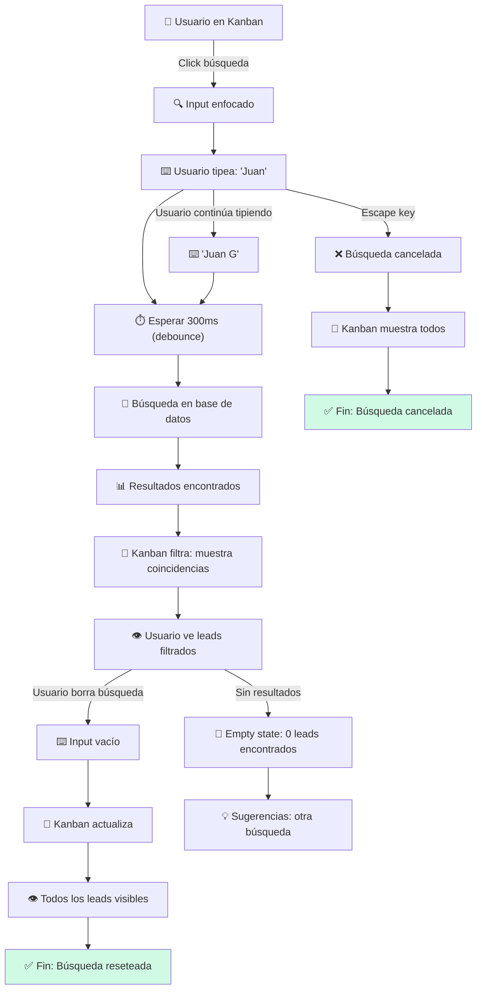
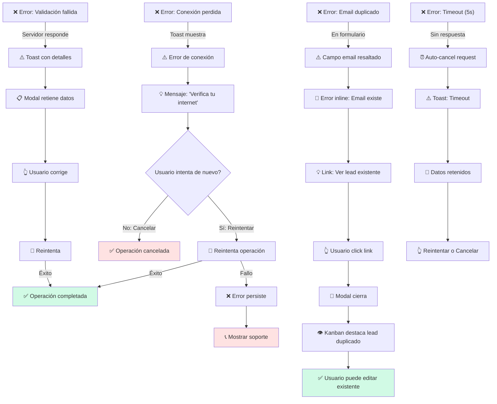
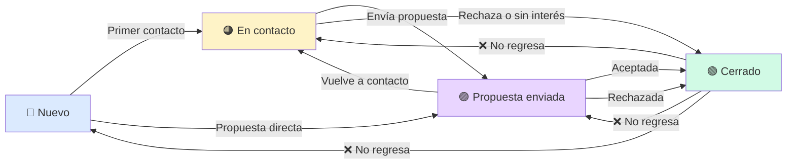

# 🔄 UX-02: Flujos de Usuario — Mini CRM Pipeline Kanban

**Documento:** User Flows con Diagramas Mermaid  
**Versión:** 1.0  
**Fecha:** 2026-06-07  
**Audiencia:** Desarrolladores, QA, Product Team  
**Estado:** Listo para Implementación  

---

## 📑 Tabla de Contenidos

1. [Flujo Principal: Crear Lead](#flujo-principal-crear-lead)
2. [Flujo Principal: Mover Lead entre Estados](#flujo-principal-mover-lead-entre-estados)
3. [Flujo Principal: Editar Lead](#flujo-principal-editar-lead)
4. [Flujo Alternativo: Búsqueda y Filtro](#flujo-alternativo-búsqueda-y-filtro)
5. [Flujo de Error: Recuperación de Fallos](#flujo-de-error-recuperación-de-fallos)
6. [Flujo de Estado: Transiciones Válidas](#flujo-de-estado-transiciones-válidas)
7. [Matriz de Cobertura de Flujos](#matriz-de-cobertura-de-flujos)

---

## Flujo Principal: Crear Lead

### Descripción

El usuario inicia el proceso de creación de un nuevo lead desde el Kanban, completa el formulario con validaciones inline, y el sistema guarda el lead en la base de datos, mostrándolo en la columna "Nuevo".

### Diagrama Mermaid

```mermaid
graph TD
    A["👤 Usuario en Kanban"] -->|Click "+ Nuevo Lead"| B["📋 Modal Crear Abierto"]
    B --> C["📝 Usuario ingresa Nombre"]
    C -->|Válido >= 2 car.| C1["✅ Campo OK"]
    C -->|Inválido| C2["❌ Error mostrado"]
    C2 --> C
    
    C1 --> D["📝 Usuario ingresa Empresa"]
    D -->|Válido >= 2 car.| D1["✅ Campo OK"]
    D -->|Inválido| D2["❌ Error mostrado"]
    D2 --> D
    
    D1 --> E["📝 Usuario ingresa Email"]
    E -->|Válido + Único| E1["✅ Campo OK"]
    E -->|Inválido| E2["❌ Error formato"]
    E2 --> E
    E -->|Duplicado| E3["❌ Email existe"]
    E3 --> E
    
    E1 --> F["📞 Usuario ingresa Teléfono (Opcional)"]
    F -->|Si ingresa| F1{Válido?}
    F1 -->|Sí| F2["✅ Campo OK"]
    F1 -->|No| F3["❌ Error formato"]
    F3 --> F
    F -->|Omitido| F2
    
    F2 --> G["📄 Usuario agrega Notas (Opcional)"]
    G -->|Max 1000 car.| G1["✅ Campo OK"]
    G -->|Omitido| G1
    
    G1 --> H{Todos requeridos válidos?}
    H -->|No| H1["🔒 Botón Crear deshabilitado"]
    H1 --> C
    H -->|Sí| H2["🔓 Botón Crear habilitado"]
    
    H2 --> I["👆 Usuario hace click en 'Crear Lead'"]
    I --> J["⏳ Loading: Enviando datos..."]
    J -->|Éxito| K["✅ Lead creado en BD"]
    J -->|Timeout| L["❌ Error de conexión"]
    J -->|Validación fallida| M["❌ Error en servidor"]
    
    K --> N["🎉 Toast: Lead creado exitosamente"]
    N --> O["📋 Modal se cierra"]
    O --> P["🔄 Kanban actualiza"]
    P --> Q["👁️ Nuevo lead visible en columna 'Nuevo'"]
    Q --> R["✅ Fin: Usuario ve lead en Kanban"]
    
    L --> S["⚠️ Toast: Error de conexión"]
    S --> T["🔄 Datos retenidos en modal"]
    T --> U["👆 Usuario puede reintentar"]
    U --> J
    
    M --> V["⚠️ Toast: Error validación"]
    V --> T
    
    H2 -->|Click Cancelar| W["❌ Modal cierra"]
    W -->|Sin cambios| X["✅ Fin: Cancelado sin guardar"]
    W -->|Con cambios| Y["❓ Confirmar abandono?"]
    Y -->|Sí, abandonar| X
    Y -->|No, continuar| B
    
    style A fill:#E0F2FE
    style R fill:#D1FAE5
    style X fill:#D1FAE5
    style L fill:#FEE2E2
    style M fill:#FEE2E2
```

### Puntos Clave

| Paso | Acción | Validación | Feedback |
|------|--------|-----------|----------|
| 1 | Click "+ Nuevo Lead" | — | Modal abre |
| 2 | Ingresa Nombre | >= 2 caracteres | ✅ o ❌ on blur |
| 3 | Ingresa Empresa | >= 2 caracteres | ✅ o ❌ on blur |
| 4 | Ingresa Email | Formato + Único | ✅ o ❌ on blur |
| 5 | Ingresa Teléfono (opt) | Formato si existe | ⚠️ on blur |
| 6 | Ingresa Notas (opt) | Max 1000 char | Contador |
| 7 | Click "Crear Lead" | Todos requeridos OK | Envío / Loading |
| 8 | Servidor procesa | Validación servidor | Toast éxito/error |
| 9 | Lead aparece | En BD y UI | Kanban actualiza |

---

## Flujo Principal: Mover Lead entre Estados

### Descripción

El usuario arrastra un lead de una columna a otra, el sistema actualiza el estado, y muestra un feedback visual durante la operación (drag, drop, loading, confirmación).

### Diagrama Mermaid

```mermaid
graph TD
    A["👤 Usuario ve Lead Card en Kanban"] -->|Hover| B["👆 Lead Card muestra grab cursor"]
    B -->|Click + Hold 200ms| C["🖱️ Iniciando Drag"]
    C --> D["🎬 Card enter dragging state"]
    D --> E["📦 Visual: Sombra, rotación, opacidad 0.7"]
    E --> F["🎯 Usuario arrastra sobre columna destino"]
    F --> G["🔍 Sistema detecta column de destino"]
    G --> H{¿Es estado válido?}
    H -->|No (mismo estado)| I["❌ Drop zona inactiva"]
    I -->|Usuario suelta| J["🔄 Lead regresa a original"]
    J -->|Animación 200ms| K["✅ Fin: Cancelado"]
    
    H -->|Sí (estado diferente)| L["🟢 Dropzone activa: border dashed azul"]
    L --> M["👆 Usuario suelta el lead"]
    M --> N["⏳ Card entra loading state (skeleton)"]
    N --> O["📡 Enviando: {lead_id, nuevo_estado}"]
    O -->|Éxito| P["✅ BD actualizada"]
    O -->|Error| Q["❌ Fallo en servidor"]
    
    P --> R["🎉 Toast: Lead movido a [Estado]"]
    R --> S["🔄 Card actualiza en nueva columna"]
    S --> T["👁️ Card animación entrada (fade-in)"]
    T --> U["✅ Fin: Lead en nuevo estado"]
    
    Q --> V["⚠️ Toast: Error al mover"]
    V --> W["🔄 Card regresa a columna original"]
    W -->|Animación 200ms| X["✅ Fin: Rollback exitoso"]
    
    A -->|Escape key durante drag| Y["🛑 Drag cancelado"]
    Y --> J
    
    style U fill:#D1FAE5
    style K fill:#FEE2E2
    style X fill:#FEE2E2
```

### Puntos Clave

| Fase | Duración | Visual | Acción Sistema |
|------|----------|--------|----------------|
| Grab Cursor | On hover | Cursor grab | — |
| Drag Inicia | 200ms hold | Sombra + rotación | Detecta posición |
| Drag Activo | Indefinida | Opacidad 0.7 | Busca dropzone |
| Over Dropzone | Instant | Border dashed azul | Valida estado |
| Drop | Instant | Skeleton loading | Envía API request |
| Loading | ≤ 5 segundos | Shimmer | Espera respuesta |
| Success | 0.2s | Fade-in card | Actualiza UI |
| Error Rollback | 0.2s | Fade-out + fade-in original | Regresa a original |

---

## Flujo Principal: Editar Lead

### Descripción

El usuario abre el modal de edición desde un lead card, modifica campos editables, valida cambios, y el sistema actualiza el lead en la base de datos.

### Diagrama Mermaid

```mermaid
graph TD
    A["👤 Usuario hace click en Lead Card"] -->|Opción: Editar| B["📋 Modal Editar Abierto"]
    B --> C["📊 Pre-carga datos del lead"]
    C --> D["✅ Modal muestra campos llenos"]
    D --> E{Usuario modifica campos?}
    
    E -->|No: Cancelar| F["❓ Confirmar sin guardar?"]
    F -->|Sí| G["✅ Modal cierra"]
    F -->|No| B
    
    E -->|Sí: Edita Nombre| H["📝 Nombre modificado"]
    H -->|On blur| H1{Válido?}
    H1 -->|Sí| H2["✅ Campo OK"]
    H1 -->|No| H3["❌ Error: Min 2 car"]
    H3 --> H
    
    E -->|Sí: Edita Empresa| I["📝 Empresa modificada"]
    I -->|On blur| I1{Válido?}
    I1 -->|Sí| I2["✅ Campo OK"]
    I1 -->|No| I3["❌ Error: Min 2 car"]
    I3 --> I
    
    E -->|Sí: Edita Email| J["📧 Email modificado"]
    J -->|On blur| J1{Válido + Único?}
    J1 -->|Sí| J2["✅ Campo OK"]
    J1 -->|No (duplicado)| J3["❌ Email existe"]
    J3 --> J
    J1 -->|No (formato)| J4["❌ Formato inválido"]
    J4 --> J
    
    E -->|Sí: Edita Teléfono| K["📞 Teléfono modificado"]
    K -->|On blur| K1{Válido si existe?}
    K1 -->|Sí| K2["✅ Campo OK"]
    K1 -->|No| K3["❌ Formato inválido"]
    K3 --> K
    
    E -->|Sí: Edita Notas| L["📄 Notas modificadas"]
    L -->|On change| L1{Max 1000 char?}
    L1 -->|Sí| L2["✅ Campo OK"]
    L1 -->|No| L3["❌ Excede límite"]
    L3 --> L
    
    E -->|Sí: Cambia Estado| M["🔄 Selecciona nuevo estado"]
    M -->|Dropdown| M1["📋 Opciones validas"]
    M1 --> M2["✅ Estado seleccionado"]
    
    H2 --> N{¿Hay cambios válidos?}
    I2 --> N
    J2 --> N
    K2 --> N
    L2 --> N
    M2 --> N
    
    N -->|No| O["🔒 Botón Guardar deshabilitado"]
    O --> E
    N -->|Sí| P["🔓 Botón Guardar habilitado"]
    
    P -->|Usuario click Guardar| Q["⏳ Loading: Guardando cambios..."]
    Q -->|Éxito| R["✅ Lead actualizado en BD"]
    Q -->|Error| S["❌ Error en servidor"]
    
    R --> T["🎉 Toast: Lead actualizado exitosamente"]
    T --> U["📋 Modal se cierra"]
    U --> V["🔄 Card en Kanban actualiza"]
    V --> W["✅ Fin: Cambios reflejados"]
    
    S --> X["⚠️ Toast: Error al guardar"]
    X --> Y["🔄 Datos retenidos en modal"]
    Y --> Z["👆 Usuario puede reintentar"]
    Z --> Q
    
    style W fill:#D1FAE5
    style G fill:#D1FAE5
    style S fill:#FEE2E2
```

### Puntos Clave

| Campo | Editable | Validación | Comportamiento |
|-------|----------|-----------|-----------------|
| Nombre | ✅ Sí | >= 2 caracteres | Inline error on blur |
| Empresa | ✅ Sí | >= 2 caracteres | Inline error on blur |
| Email | ✅ Sí | Único + Formato | Inline error on blur |
| Teléfono | ✅ Sí | Formato si existe | Inline error on blur |
| Notas | ✅ Sí | Max 1000 caracteres | Contador, inline error |
| Estado Actual | ❌ Read-only | — | Badge informativo |
| Mover a Estado | ✅ Opcional | Valida disponibles | Dropdown con opciones |

---

## Flujo Alternativo: Búsqueda y Filtro

### Descripción

El usuario utiliza la búsqueda para filtrar leads por nombre, empresa o email. El sistema busca con debounce 300ms y muestra resultados en tiempo real.

### Diagrama Mermaid



### Especificaciones de Búsqueda

| Aspecto | Valor |
|--------|-------|
| Debounce | 300ms |
| Campos buscados | Nombre, Empresa, Email, Notas (parcial match) |
| Case-sensitive | No (ignora mayúsculas) |
| Resultados mínimos | 1 |
| Resultados máximos | Todos (sin paginación MVP) |
| Tiempo máximo búsqueda | 2 segundos |

---

## Flujo de Error: Recuperación de Fallos

### Descripción

Manejo de errores comunes y recuperación del sistema cuando ocurren fallos (conexión, validación, timeout).

### Diagrama Mermaid



### Error Handling Matrix

| Error | Trigger | Usuario ve | Acción | Recuperación |
|-------|---------|-----------|--------|--------------|
| Conexión perdida | API timeout | Toast error | Reintentar/Cancelar | Reintenta request |
| Email duplicado | Crear/Editar | Campo error inline | Link ver existente | Navega a lead |
| Validación fallida | Servidor rechaza | Toast + detalles | Corrige campos | Guarda de nuevo |
| Timeout (5s) | Sin respuesta | Toast timeout | Reintentar | Reenvía request |
| Lead no encontrado | ID inválido | Toast 404 | Volver a Kanban | Refresh page |
| Permisos insuficientes | No autorizado | Toast 403 | Contactar admin | — |

---

## Flujo de Estado: Transiciones Válidas

### Descripción

El pipeline tiene 4 estados con transiciones válidas predefinidas. No todos los estados pueden ir directamente a otros.

### Diagrama Mermaid



### Matriz de Transiciones Válidas

| Desde | A (Nuevo) | B (En contacto) | C (Propuesta) | D (Cerrado) |
|------|-----------|-----------------|---------------|-------------|
| **A (Nuevo)** | — | ✅ Sí | ✅ Sí | ❌ No |
| **B (En contacto)** | ❌ No | — | ✅ Sí | ✅ Sí |
| **C (Propuesta)** | ❌ No | ✅ Sí | — | ✅ Sí |
| **D (Cerrado)** | ❌ No | ❌ No | ❌ No | — |

### Lógica de Transiciones

```javascript
// Pseudo-código de validación de transiciones

function isValidTransition(currentState, targetState) {
  const validTransitions = {
    'Nuevo': ['En contacto', 'Propuesta enviada'],
    'En contacto': ['Propuesta enviada', 'Cerrado'],
    'Propuesta enviada': ['En contacto', 'Cerrado'],
    'Cerrado': [] // Terminal state
  };
  
  return validTransitions[currentState].includes(targetState);
}

// Uso
isValidTransition('Nuevo', 'En contacto') // true
isValidTransition('Cerrado', 'Nuevo') // false
```

---

## Matriz de Cobertura de Flujos

| Flujo | Caso Happy Path | Caso Error | Caso Edge | Automatización QA |
|-------|-----------------|-----------|----------|------------------|
| **Crear Lead** | ✅ Crear con todos campos | ❌ Email duplicado | ⚠️ Campos vacíos | Pytest + Selenium |
| **Mover Lead** | ✅ Drag & drop válido | ❌ Conexión perdida | ⚠️ Drop inválido | Playwright E2E |
| **Editar Lead** | ✅ Edita y guarda | ❌ Validación fallida | ⚠️ Email duplicado | Pytest + Selenium |
| **Búsqueda** | ✅ Encuentra lead | ❌ No hay resultados | ⚠️ Búsqueda vacía | Pytest |
| **Estados** | ✅ Transición válida | ❌ Transición inválida | ⚠️ Estado desconocido | Pytest |
| **Errores** | ✅ Toast aparece | ❌ Error persiste | ⚠️ Múltiples errores | Playwright E2E |

---

## Notas Importantes

1. **Debounce Search**: 300ms de espera para no sobrecargar servidor
2. **Drag Timeout**: Hold ≥ 200ms para iniciar arrastre
3. **API Timeout**: 5 segundos máximo de espera
4. **Transiciones**: Validar en frontend y backend
5. **Rollback**: Siempre regresar a estado anterior si falla
6. **Toast Auto-dismiss**: 3s éxito, 5s error
7. **Loading State**: Mostrar siempre durante operaciones async
8. **Keyboard Support**: Escape para cancelar, Tab para navegar
9. **Accessibility**: ARIA roles, screen reader support
10. **Analytics**: Track flujos completados vs abandonados

